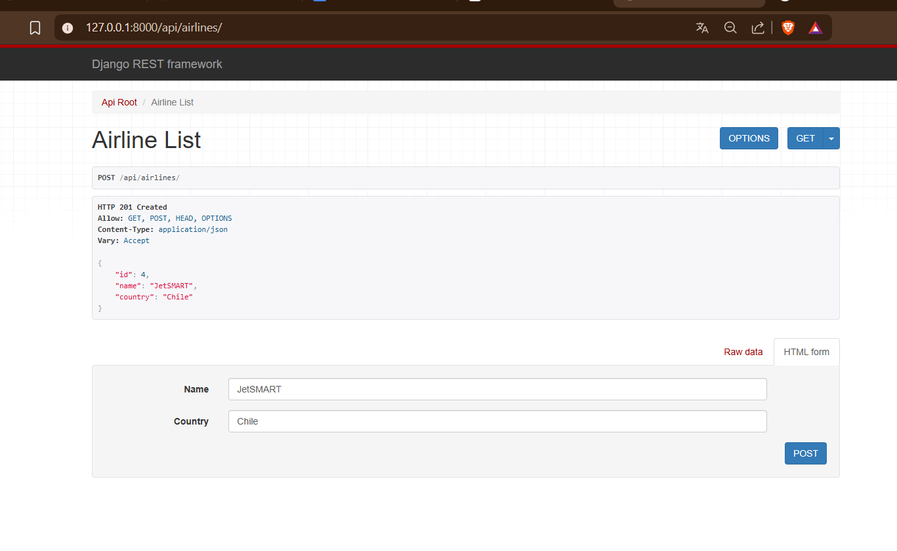
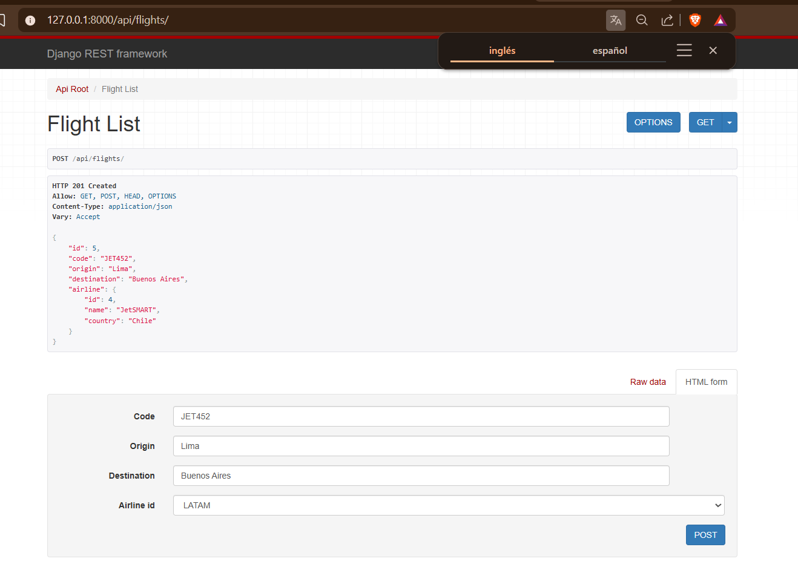
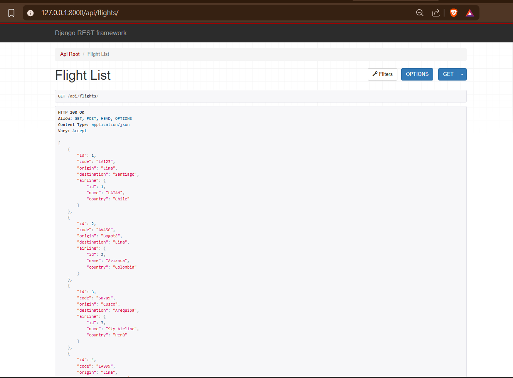
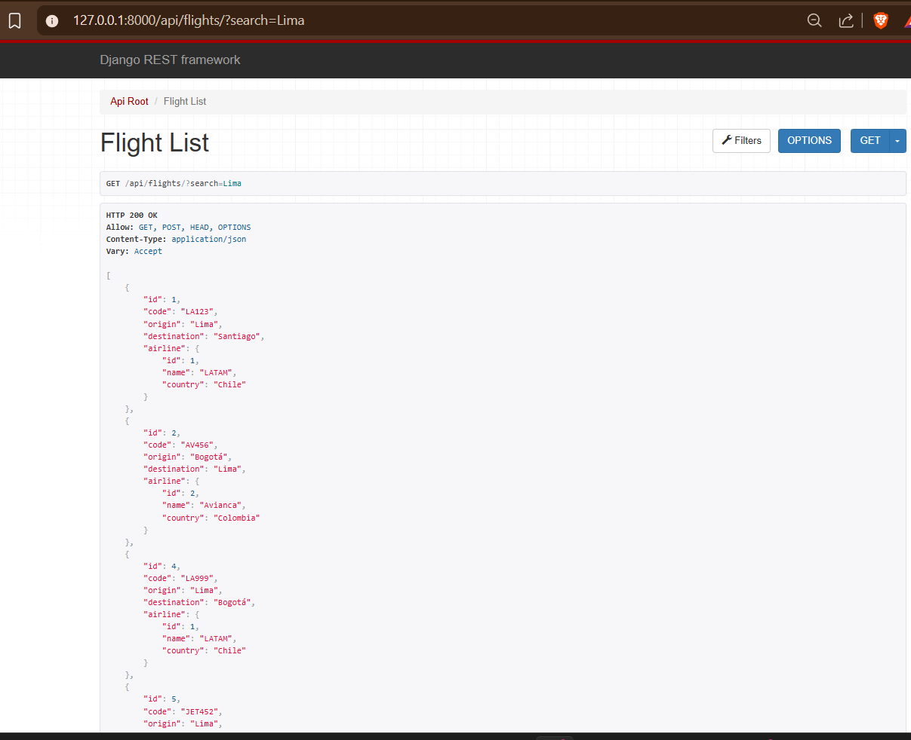
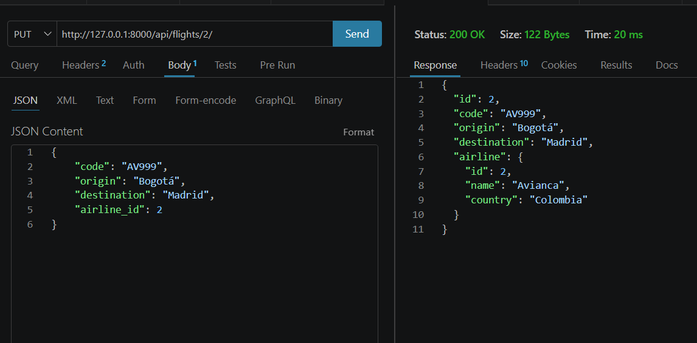
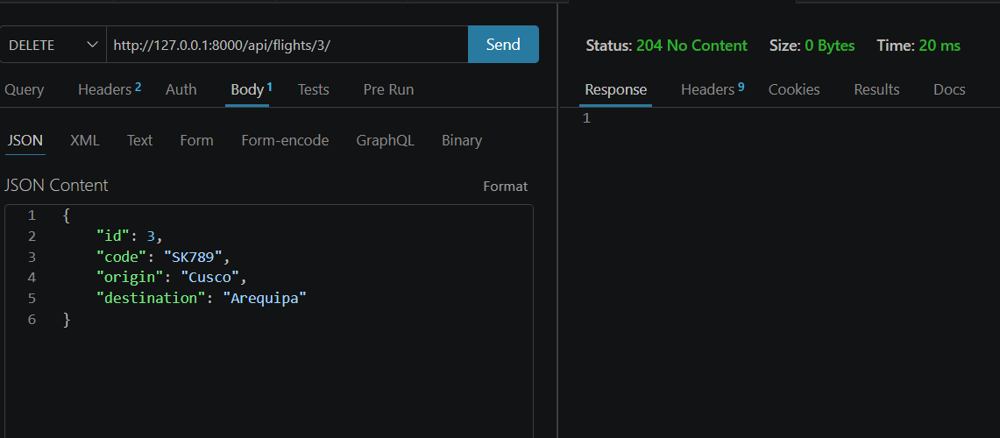
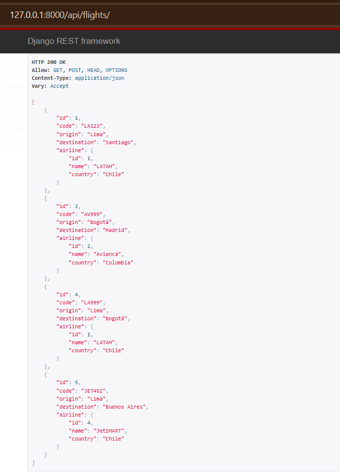

# ✈️ SkyRoute API - Gestor de Vuelos

API REST desarrollada con Django y Django REST Framework para la gestión de vuelos y aerolíneas.

---

## 🚀 Tecnologías utilizadas

* Python
* Django
* Django REST Framework
* SQLite
* Git

---

## ⚙️ Instalación y ejecución

1. Clonar el repositorio:

```bash
git clone <https://github.com/jort-tec-snt/skyroute_api>
cd skyroute_api
```

2. Crear entorno virtual:

```bash
python -m venv venv
```

3. Activar entorno virtual:

```bash
source venv/Scripts/activate
```

4. Instalar dependencias:

```bash
pip install -r requirements.txt
```

5. Aplicar migraciones:

```bash
python manage.py migrate
```

6. Ejecutar servidor:

```bash
python manage.py runserver
```

---

## 🧩 Modelo de datos

### ✈️ Airline

* id
* name
* country

### ✈️ Flight

* id
* code
* origin
* destination
* airline (relación)

---

## 🔗 Endpoints principales

### ✈️ Flights

| Método | Endpoint                  | Descripción      |
| ------ | --------------------------| ---------------- |
| GET    | /api/flights/             | Listar vuelos    |
| POST   | /api/flights/             | Crear vuelo      |
| GET    | /api/flights/{id}/        | Obtener vuelo    |
| PUT    | /api/flights/{id}/        | Actualizar vuelo |
| DELETE | /api/flights/{id}/        | Eliminar vuelo   |
| GET    | /api/flights/?search=Json | Buscar vuelos    |

---

### 🏢 Airlines

| Método | Endpoint            | Descripción       |
| ------ | ------------------- | ----------------- |
| GET    | /api/airlines/      | Listar aerolíneas |
| POST   | /api/airlines/      | Crear aerolínea   |
| PUT    | /api/airlines/{id}/ | Actualizar        |
| DELETE | /api/airlines/{id}/ | Eliminar          |

---

## 🔍 Funcionalidades implementadas

✔ CRUD completo de vuelos
✔ CRUD completo de aerolíneas
✔ Búsqueda de vuelos por origen, destino o código
✔ Relación entre vuelos y aerolíneas
✔ Respuesta personalizada con datos de la aerolínea

---

## 🧪 Ejemplo de respuesta

```json
{
    "id": 1,
    "code": "LA123",
    "origin": "Lima",
    "destination": "Santiago",
    "airline": {
        "id": 1,
        "name": "LATAM",
        "country": "Chile"
    }
}
```

---

## 📸 Evidencias (capturas)

### 1. Creación de aerolíneas



Descripción: Se crea una aerolínea mediante POST.

---

### 2. Creación de vuelos



Descripción: Se crea un vuelo relacionado a una aerolínea.

---

### 3. Listado de vuelos



Descripción: Se listan todos los vuelos registrados.

---

### 4. Búsqueda de vuelos




Descripción: Se realiza búsqueda usando query param ?search=Lima.

---

### 5. Actualización de vuelo



Descripción: Se modifica un vuelo existente mediante PUT.

---

### 6. Eliminación de vuelo



Descripción: Se elimina un vuelo mediante DELETE.

### 7. Demostración final de los cambios.



---2

## 🐙 Control de versiones

Se utilizó Git con commits progresivos:

* init project
* add models
* create serializers
* add viewsets
* implement search
* add nested serializer

---

## 🎯 Conclusión

Se desarrolló una API REST completa cumpliendo todos los requisitos solicitados, aplicando buenas prácticas de desarrollo y estructura escalable.
